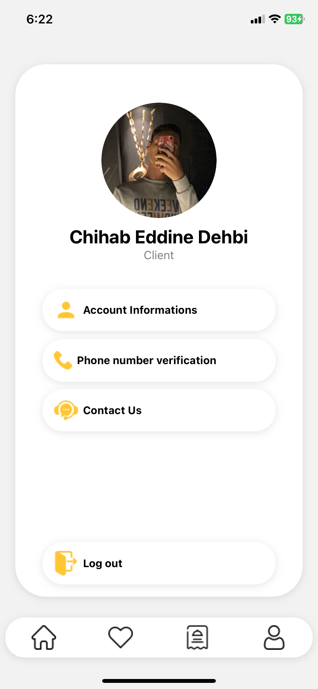
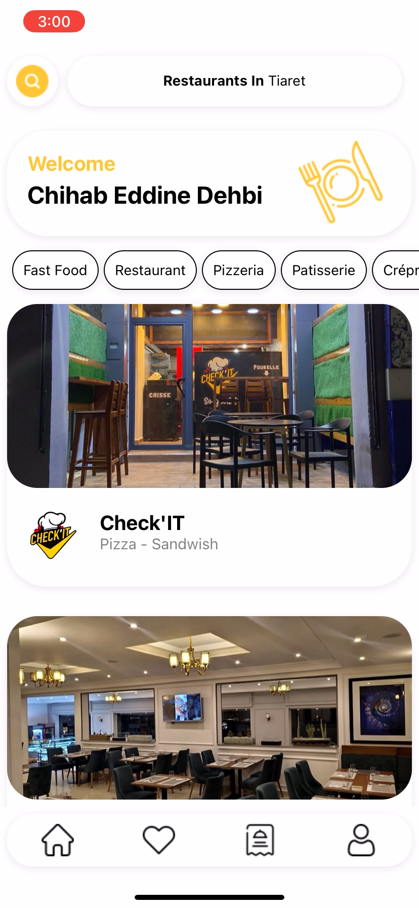
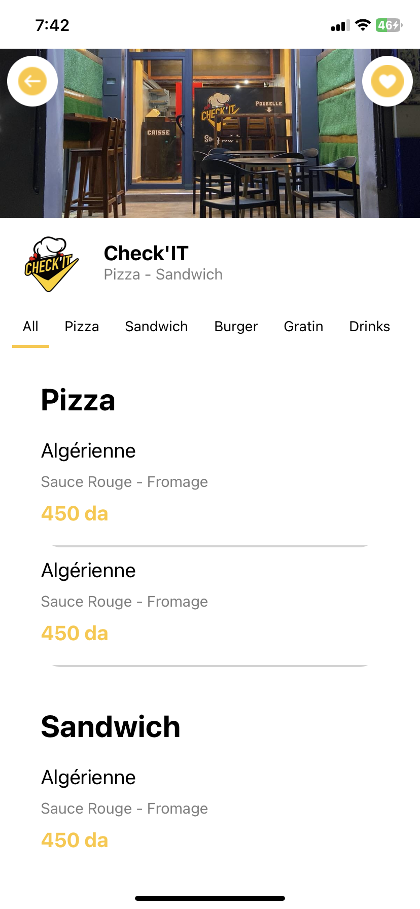
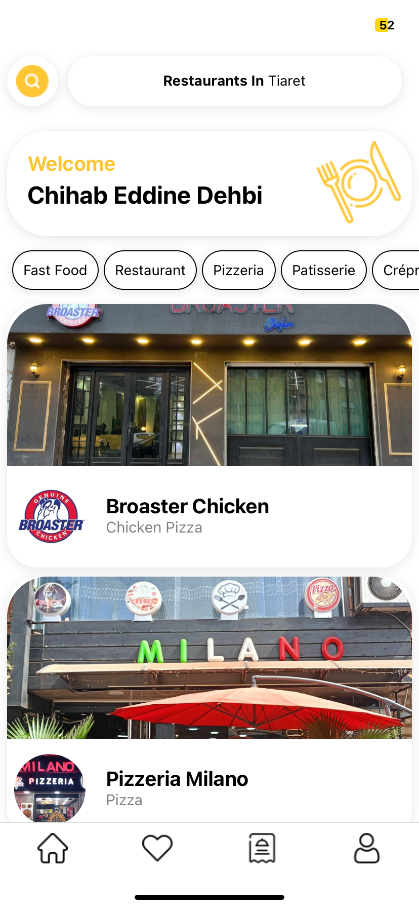
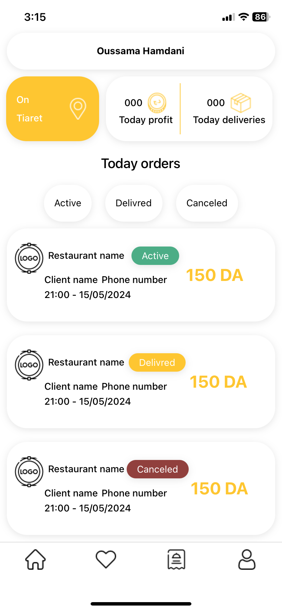
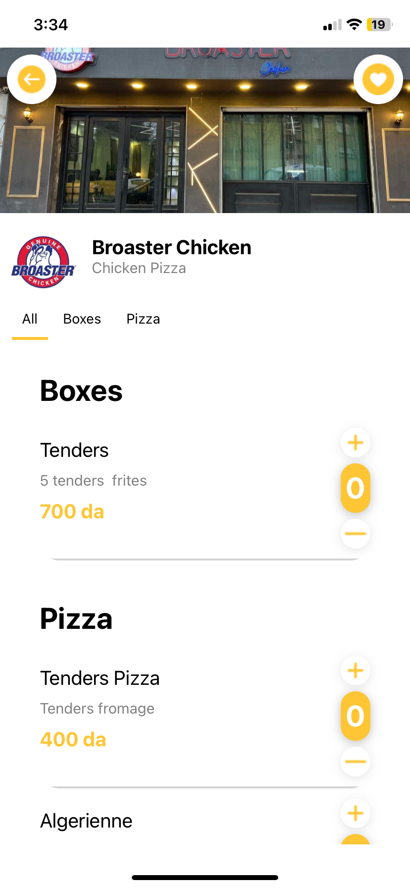

# 🍔 FOODZ (Food Delivery App)  

[](https://reactnative.dev/)  
[](https://expo.dev/)  
[](https://firebase.google.com/)  
[](https://www.infobip.com/)  
[](https://developers.google.com/maps)  
[](https://openrouteservice.org/)  
[](#)   

A **cross-platform food delivery system** built with **React Native + Expo**, featuring **client, driver, and admin dashboards**.  
It integrates **Firebase** for data storage, **Infobip** for **phone number authentication**, and supports **live driver tracking**, **push notifications**, and **smart delivery assignment** using **Google Maps & OpenRoute APIs**.  

---

## 🚀 Features  

### 👤 Client App  
- 📍 Auto-detect location on login.  
- 🍴 Browse restaurants and menus.  
- 🛒 Place and track orders in real time.  
- 🔑 **Phone number authentication via Infobip**.  
- 💳 **Dynamic delivery fee** calculated based on distance from restaurant.  
- 🔔 Instant **push notifications** for order updates.  

### 🛵 Driver App  
- 📋 View available delivery requests.  
- ✅ Accept and complete deliveries.  
- 📡 **Live location tracking** with Google Maps.  
- 💰 Earnings calculation (70% driver / 30% owner).  
- 🔔 **Push notifications** for new delivery requests and status changes.  

### 🛠️ Admin Dashboard  
- 🏢 Manage restaurants (Add, Edit, Delete).  
- 📊 Monitor orders and deliveries.  
- 👥 Manage drivers and clients.  
- 💸 Track owner earnings.  
- 🤖 **Smart delivery assignment**: assigns orders to the nearest available driver automatically.  

---

## 📂 Project Structure  
```
assets/ # Images, icons, and static files
screens/ # App screens (Clients, Drivers, Admin)
├── AddNewResturant.js
├── AdminHome.js
├── AdminResturantMenu.js
├── DriverActiveOrder.js
├── DriverHome.js
├── HomeScreen.js
├── HomeScreenC.js
├── LoginScreen.js
├── OrderDetailsClient.js
├── ResturantMenuScreen.js
├── SignUpScreen.js
.gitignore
App.js # App entry point
UserContext.js # Global user context
app.json
babel.config.js
eas.json
firebase.js # Firebase config
node.js
server.js # Backend server logic
tsconfig.json
usePushNotifications.ts # Push notifications handler
package.json
package-lock.json
```
---

## 🛠️ Installation  

1. Clone the repository:  
   ```bash
   git clone https://github.com/your-username/food-delivery-app.git
   cd food-delivery-app
   ```


2. Install dependencies:
```
npm install
Add Firebase config in firebase.js.
Set up Infobip & API credentials in your .env:
INFOBIP_API_KEY=your_infobip_key
INFOBIP_BASE_URL=https://your-subdomain.api.infobip.com
GOOGLE_MAPS_API_KEY=your_google_maps_key
OPENROUTE_API_KEY=your_openroute_key
```
3. Start the app:
```
npx expo start
```
---

📦 Requirements
```
Main dependencies:
react-native
expo
firebase
infobip-api-client
react-navigation
axios
dotenv
```
---
📡 APIs & Services
```
Infobip → Secure phone number authentication.
Firebase → Firestore database & push notifications.
Google Maps API → Real-time maps, distance calculation.
OpenRoute API → Routing & delivery optimization.
```
---
👥 Roles
- Client → Order food, track deliveries, pay distance-based fees.
- Driver → Accept orders, live tracking, earnings system.
- Admin → Manage restaurants, users, orders, and revenue.
---
📈 Business Model
- Delivery fee: calculated dynamically based on client distance from restaurant.
- Earnings split: 70% Driver / 30% Owner.
- Driver pays owner’s share monthly.
---
📲 Screens Overview
- Login / Signup → with phone number verification via Infobip.
- Client Home → Restaurants, menus, order placement.
- Driver Dashboard → Active orders, live map, push notifications, earnings.
- Admin Dashboard → Manage restaurants, drivers, and orders.
---
🔒 Authentication
- Role-based login system: Admin | Driver | Client.
- Infobip phone number authentication ensures secure access.
---
⚡ Future Improvements
- 💳 Online payment gateway integration.
- 📦 Advanced analytics dashboard for admins.
- 🌍 Multi-language support.
---
👨‍💻 Author
 - Built by Chihab Eddine Dehbi — Biomedical Engineer & Full-Stack Developer.
---
## 📄 License

This project is licensed under **All Rights Reserved © 2025 Chihab Eddine Dehbi**.  
It is shared publicly **for portfolio and demonstration purposes only**.  

✅ You are free to explore the code and screenshots.  
❌ You may **not** copy, modify, distribute, or use it in any way without my explicit written permission.  

For collaboration or licensing inquiries, please reach out via [LinkedIn](https://www.linkedin.com/in/chihab-eddine-dehbi-755321366) or chihabdehbi8@gmail.com.
---
## 📸 Screenshots

<p align="center">
  
  
  
</p>

<p align="center">
  
   
  
</p>


